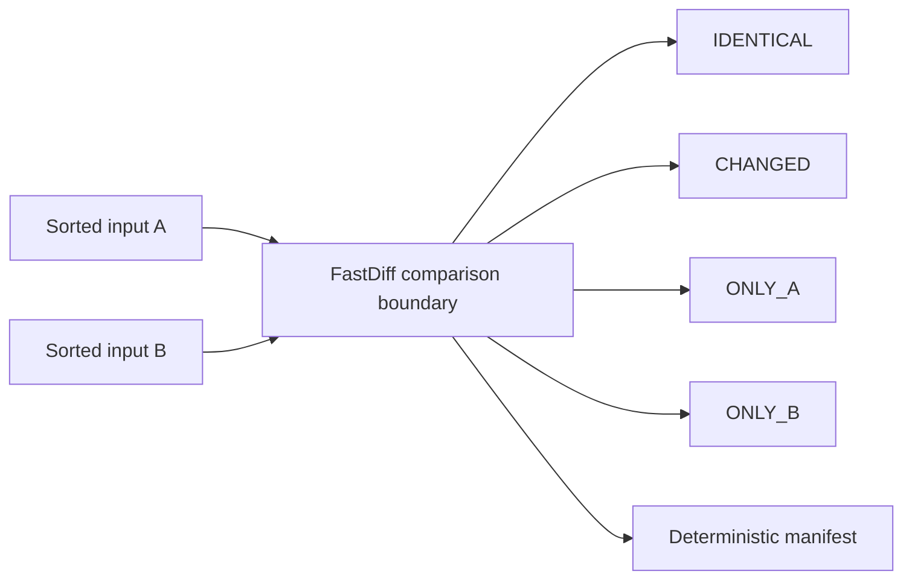
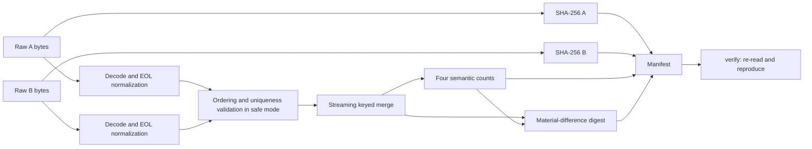
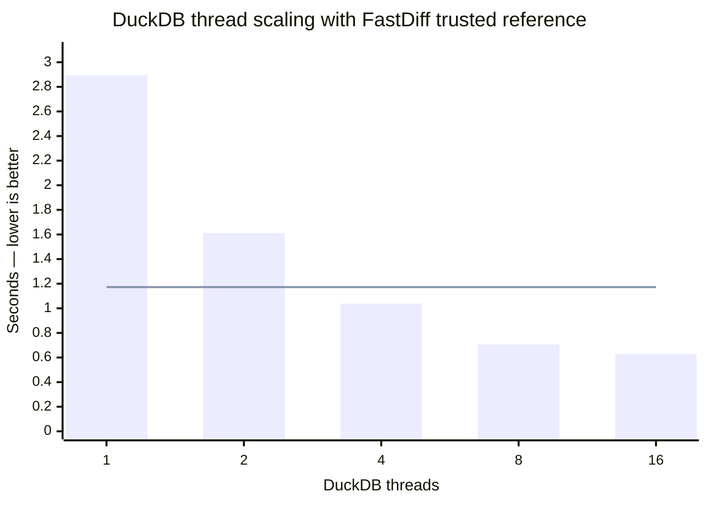
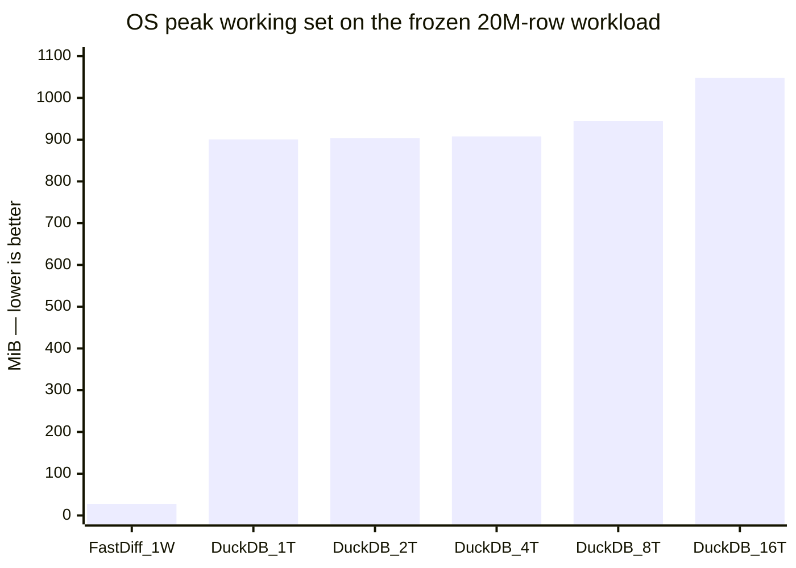
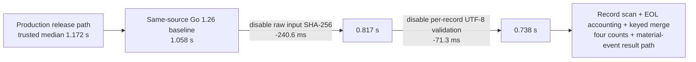

# FastDiff

## One Thread, Twenty Million Rows, and the Cost of Verifiability

**Author:** cxclrfx  
**Release:** FastDiff v0.2.1  
**Date:** 25 August 2026  
**Status:** Independent technical release and reproducible benchmark report

> FastDiff is a local, read-only, evidence-preserving keyed-diff engine for sorted tabular data. It classifies every logical record as `IDENTICAL`, `CHANGED`, `ONLY_A`, or `ONLY_B`, while binding the run to the exact input bytes, comparison semantics, material differences, and final counts.

---

## Abstract

The first external comparison appeared simple:

```text
DuckDB 16-thread default:  ~0.625 s
FastDiff trusted mode:     ~1.172 s
```

Stopping there would have produced an easy but incomplete conclusion: DuckDB was about 1.88 times faster.

We did not stop there.

The inputs were frozen, their hashes were preserved, the output classes were independently reconciled, and the benchmark was decomposed one variable at a time. DuckDB was then measured at 1, 2, 4, 8, and 16 threads. Windows peak working set was measured separately. FastDiff's ordering checks, raw input SHA-256 computation, and per-record UTF-8 validation were isolated through controlled ablations built from the same frozen source.

The full result is not a single winner/loser number. It is a resource-and-evidence map:

- FastDiff's production comparison path is non-parallel and streaming.
- FastDiff trusted mode processed **20,000,001 input rows / 493.89 MiB** in a median **1.172 s** with an OS-reported peak working set of **27.84 MiB**.
- DuckDB on one thread required a median **2.894 s** and **900.52 MiB** peak working set for the same four semantic counts.
- DuckDB overtook FastDiff between two and four threads, reaching a median **0.629 s** at 16 threads, with **1,048.30 MiB** peak working set.
- FastDiff was **2.47x faster than one-thread DuckDB**, while DuckDB used **32.35x the peak working set**.
- DuckDB at 16 threads was **1.86x faster in raw count-only wall time**, while using **37.65x the FastDiff peak working set**.
- In same-toolchain experimental ablations, removing only raw input SHA-256 reduced FastDiff from **1.058 s to 0.817 s**. Removing per-record UTF-8 validation next reduced it to **0.738 s**.
- That experimental, non-production path remained non-parallel and landed within **4.55%** of DuckDB at eight threads.

The benchmark therefore answers a more useful question than “which number is smaller?” It shows what each number costs, what each execution actually proves, and where the performance is coming from.

---

## 1. The problem FastDiff solves

A line-oriented diff is not a keyed data reconciliation engine.

When the same entity remains present under the same key but one field changes, a text diff may describe the event as one deletion and one insertion. For data pipelines, audits, allocations, financial exports, incident evidence, and governance snapshots, the required semantic object is different:

```text
same key + same payload     -> IDENTICAL
same key + different payload -> CHANGED
key exists only in A        -> ONLY_A
key exists only in B        -> ONLY_B
```

FastDiff performs that classification over two sorted inputs using a streaming merge. It does not modify either source, deploy database changes, or synchronize production systems.



FastDiff intentionally exposes four commands:

```text
compare
verify
export
benchmark
```

The product is small because its obligation is narrow and exact.

---

## 2. The difference between a result and an evidence object

A count such as `33,333 changed rows` is useful. It is not sufficient by itself.

A reproducible comparison must also bind:

- the exact bytes of input A;
- the exact bytes of input B;
- the detected input encodings;
- line-ending statistics;
- the key column and key type;
- header semantics;
- safe or trusted-sorted mode;
- the four final counts;
- the material difference stream;
- the semantic result digest;
- the exact binary and version used to produce the result.

FastDiff's normal comparison path therefore creates more than four counters.



`verify` re-reads the original files and requires all of the following to agree:

```text
input SHA-256 A
input SHA-256 B
result counts
semantic result digest
```

This distinction matters throughout the benchmark. DuckDB was used as a strong general-purpose analytical reference, but the count-only SQL query did not perform FastDiff's raw input hashing, sorted/duplicate validation, semantic digest construction, or manifest verification.

---

## 3. Release surface

FastDiff v0.2.1 supports:

- CSV;
- TSV;
- semicolon-delimited input;
- pipe-delimited input;
- any single-character delimiter accepted by the CLI;
- optional headers;
- any zero-based key column;
- signed `int64` keys in numeric order;
- string keys in lexical order;
- UTF-8;
- UTF-8 BOM;
- UTF-16LE BOM;
- UTF-16BE BOM;
- explicit Windows-1252;
- explicit Latin-1;
- LF;
- CRLF;
- LF-to-CRLF semantic comparison;
- missing final newline;
- configurable physical-record limit, defaulting to 64 MiB.

Safe mode is the default. It checks ordering and duplicate keys while comparing.

```powershell
.\fastdiff_windows_amd64.exe compare --key-type int A.csv B.csv
```

For data whose sorting and uniqueness have already been independently qualified, trusted mode skips those two checks:

```powershell
.\fastdiff_windows_amd64.exe compare `
  --key-type int `
  --trusted-sorted `
  --encoding-a utf-8 `
  --encoding-b utf-8 `
  A.csv B.csv
```

`--trusted-sorted` is not a correctness bypass for arbitrary input. It delegates a proven precondition to the caller.

### Deliberate v0.2.1 boundaries

The release does not claim:

- multiline quoted CSV records;
- composite keys;
- automatic sorting;
- direct database connectors;
- schema diff;
- database mutation or synchronization;
- automatic legacy-codepage guessing;
- CR-only line endings.

These are explicit scope boundaries, not hidden assumptions.

---

## 4. Qualification before comparison

Before the external benchmark, the release was qualified independently of DuckDB:

```text
38 named Go tests                              PASS
1,000 deterministic randomized oracle cases  PASS
Go race detector                              PASS
Go vet                                        PASS
Go test                                       PASS
Statement coverage                            62.1% observed
```

The randomized qualification compares FastDiff against an independently constructed map-based oracle. The suite also covers:

- CRLF and mixed LF/CRLF;
- UTF-8 BOM;
- UTF-16LE and UTF-16BE;
- malformed UTF-16 rejection;
- Windows-1252 and Latin-1;
- quoted CSV fields;
- semantically equivalent CSV quoting;
- TSV, semicolon, and pipe delimiters;
- non-zero key columns;
- headerless and empty inputs;
- numeric and string keys;
- `int64` minimum value;
- duplicate and unsorted rejection;
- numeric leading-zero collisions;
- invalid UTF-8 rejection;
- long-record handling and configured limits;
- input/output alias rejection;
- no partial final output after failure;
- no-overwrite behavior;
- manifest tamper detection;
- result-digest count binding;
- result-digest schema binding;
- semantic digest invariance across EOL/encoding;
- safe/trusted equivalence on valid inputs.

Repeated release builds were byte-identical for Linux amd64, Windows amd64, and Windows arm64.

Windows amd64 release SHA-256:

```text
e77eeb1d24a00aee3aa15351c4fc2988afefb34e2bfbe2e3c47cbc7f5b5dc2dd
```

Frozen source `main.go` SHA-256 used for the later Go 1.26.7 ablations:

```text
e0e147286976c1ea414281fb693a651566ef58eee43a5b8858fa2f9cbf046f29
```

---

## 5. Benchmark environment

| Field | Value |
|---|---|
| OS | Microsoft Windows NT 10.0.26200.0, 64-bit |
| PowerShell | 5.1.26100.8875 |
| CPU | Intel Core i5-14400F |
| CPU topology | 10 physical cores / 16 logical processors |
| Physical RAM | 68,464,066,560 bytes / 63.76 GiB |
| Storage | Samsung MZVL81T0HELB-00BH1, 1,024,203,640,320 bytes |
| FastDiff release | v0.2.1 |
| FastDiff Windows binary SHA-256 | `e77eeb1d24a00aee3aa15351c4fc2988afefb34e2bfbe2e3c47cbc7f5b5dc2dd` |
| DuckDB | v1.5.5 “Variegata”, commit `d8cdaa33fd` |
| Go used for controlled ablations | go1.26.7 windows/amd64 |

Normal Windows protections remained enabled. Smart App Control was not disabled to obtain a benchmark result.

### “One thread” terminology

FastDiff uses one non-parallel comparison stream: no parallel CSV reader, no worker pool, and no parallel merge path are implemented in `Compare`. The Go runtime may maintain internal operating-system threads, but FastDiff does not distribute the comparison across multiple data-processing workers. DuckDB thread counts were explicitly set to 1, 2, 4, 8, and 16.

---

## 6. The frozen benchmark object

The Windows qualification harness generated one deterministic CRLF pair using:

```text
rows        = 10,000,000
change rate = 0.01
eol A       = CRLF
eol B       = CRLF
key type    = signed int64
schema      = id,value
```

The resulting object was frozen and reused for every comparison.

| Property | Input A | Input B |
|---|---:|---:|
| Data rows | 10,000,000 | 10,000,001 |
| Bytes | 258,888,900 | 258,988,926 |
| CRLF records including header | 10,000,001 | 10,000,002 |
| Encoding | UTF-8 | UTF-8 |
| SHA-256 | `5b27dfdaa4795858ba133fc62184039180d6b8707b40e1048b84927ae9e8ffda` | `9d0c4148bca7124e1d818bd5540fae9c09040364840097346f30366466ee1ae9` |

Combined workload:

```text
20,000,001 data rows
517,877,826 input bytes
493.89 MiB
```

The exact semantic ground truth was:

```text
IDENTICAL  9,933,334
CHANGED       33,333
ONLY_A        33,333
ONLY_B        33,334
```

The four classes reconcile exactly to both inputs:

```text
A = IDENTICAL + CHANGED + ONLY_A = 10,000,000
B = IDENTICAL + CHANGED + ONLY_B = 10,000,001
```

Frozen semantic result digest:

```text
32ea0dd3ba0b4ea9ba110defdd8ea05ec0e17bda155dddb3ddc07e87144e3d26
```

The same counts and digest survived safe runs, trusted runs, material JSONL output, manifest verification, LF/CRLF transport variation, warm repeats, and the post-reboot first-read run.

---

## 7. Measurement protocol

The benchmark followed five rules.

### 7.1 Same semantic obligation

DuckDB executed a `FULL OUTER JOIN` by `id` and returned the same four classes. Before timing, the DuckDB query was run directly and produced the exact FastDiff ground truth.

### 7.2 Same data and machine

Every timed comparison used the frozen A/B pair on the same Windows computer and storage device.

### 7.3 Dedicated speed and memory measurements were separated

Speed medians came from dedicated wall-clock runs. Peak memory came from separate Windows process-observation runs. Memory-harness elapsed times are not substituted for dedicated speed medians.

### 7.4 Run order was alternated

FastDiff and DuckDB were alternated where both were measured together, reducing systematic advantage from always running one implementation first.

### 7.5 Invalid measurements were rejected

Two harness defects were found during the work:

- A PowerShell case-insensitive variable collision replaced the FastDiff executable path with a timing value and produced impossible sub-50 ms “runs.” Every affected number, including a false `23.456x` result, was discarded.
- A convenience `CountsOK` regex in the memory-scaling harness expected three occurrences of `33333` instead of the correct two. The flag was discarded; query correctness had already been established by direct semantic checks.

An experimental result-digest ablation was also not promoted because Windows Application Control blocked one unsigned locally built executable. Windows protection was not weakened to force a result.

---

## 8. Windows qualification and first-read stability

The full safe-mode qualification used the same frozen inputs before and after a reboot.

```text
POST_REBOOT_FIRST_READ  1.4753891 s
WARM_1                  1.4773063 s
WARM_2                  1.4664586 s
WARM_3                  1.4553626 s
Warm median             1.4664586 s
```

The post-reboot first read differed from the warm median by approximately **0.61%** and fell inside the warm-run range.

The label remains deliberately precise: `POST_REBOOT_FIRST_READ`, not “proof of a perfectly empty cold cache.” Windows Defender, indexing, storage firmware, or another background component may touch a file after reboot.

The first-read run nevertheless re-established:

```text
same input SHA-256 A
same input SHA-256 B
same four counts
same semantic result digest
```

---

## 9. FastDiff release performance

### 9.1 Safe mode

Six dedicated runs:

```text
1.456863
1.462967
1.467393
1.464088
1.458171
1.455016 seconds
```

Median:

```text
1.460569 s
13.69 million input rows/s
```

### 9.2 Trusted-sorted mode

Six dedicated runs:

```text
1.178905
1.172910
1.160944
1.211031
1.171987
1.153365 seconds
```

Median:

```text
1.1724485 s
17.06 million input rows/s
```

Moving from safe mode to a previously qualified trusted-sorted input reduced wall time by **19.73%** and increased throughput by **1.246x**. The comparison counts and semantic result digest remained unchanged.

Explicit UTF-8 selection versus encoding auto-detection changed the median by only **0.067%**, so encoding detection did not explain the safe-to-trusted improvement.

---

## 10. DuckDB thread scaling

The DuckDB query used explicit column types and `parallel=true`. Only `SET threads = N` changed across the scaling curve.

Median dedicated wall times:

| DuckDB threads | Median seconds | Input rows/s |
|---:|---:|---:|
| 1 | 2.893755 | 6.91 M/s |
| 2 | 1.611052 | 12.41 M/s |
| 4 | 1.038037 | 19.27 M/s |
| 8 | 0.705448 | 28.35 M/s |
| 16 | 0.629100 | 31.79 M/s |

A separate six-run default-thread comparison produced a consistent median of **0.625026 s**.



**Chart key:** bars are DuckDB; the horizontal line is FastDiff trusted mode with one non-parallel comparison stream.

The curve answers the original question directly:

- FastDiff trusted was **2.47x faster than DuckDB at one thread**.
- FastDiff trusted was **1.37x faster than DuckDB at two threads**.
- DuckDB overtook FastDiff between two and four threads.
- DuckDB accelerated **4.60x** from one to sixteen threads.
- Scaling began to saturate after eight threads: doubling from 8 to 16 reduced time by only **10.82%**.

### 10.1 Where the acceleration came from

Two additional controls separated thread availability from the parallel CSV path:

```text
threads=1, parallel CSV=true       median 2.883804 s
default threads, parallel=false    median 2.690114 s
threads=1, parallel=false          median 2.857929 s
default threads, parallel=true     median ~0.625 s
```

`parallel=true` did not help with only one thread. Multiple threads with serial CSV produced only a modest improvement. The major acceleration appeared when multiple threads and the parallel CSV path were enabled together.

The initial `0.625 s` result was therefore real, but its source was parallel execution—not a superior one-thread keyed-diff path.

---

## 11. Peak-memory profile

Windows process peak working set was measured separately on the same workload.

| Engine and mode | Comparison workers / threads | Dedicated speed median | OS peak working set | Peak WS relative to FastDiff |
|---|---:|---:|---:|---:|
| **FastDiff trusted** | non-parallel | **1.172 s** | **27.84 MiB** | **1.00x** |
| DuckDB | 1 | 2.894 s | 900.52 MiB | 32.35x |
| DuckDB | 2 | 1.611 s | 903.68 MiB | 32.46x |
| DuckDB | 4 | 1.038 s | 907.55 MiB | 32.60x |
| DuckDB | 8 | 0.705 s | 944.70 MiB | 33.93x |
| DuckDB | 16 | 0.629 s | 1,048.30 MiB | 37.65x |



The memory result is as important as the time result.

DuckDB already used about **900 MiB** at one thread. Moving to sixteen threads increased peak working set by about **16.4%**, while reducing wall time by 4.60x. In this workload, most of DuckDB's working-state cost was present before the full 16-thread acceleration.

FastDiff occupied a fundamentally different point in the design space:

```text
FastDiff trusted
1 non-parallel comparison stream
1.172 s dedicated median
27.84 MiB OS peak working set
raw input SHA-256 + semantic result digest retained
```

The conclusion is not that memory is always more important than time. The conclusion is that raw wall time without the resource price is an incomplete measurement.

---

## 12. The measured cost of integrity work

FastDiff deliberately performs work that the count-only DuckDB query did not perform. Controlled ablations measured two of those costs using the same frozen source and the same Go 1.26.7 toolchain.

### 12.1 Raw input SHA-256

Eight interleaved runs compared:

```text
same code and compiler
same inputs
same trusted-sorted path
same four counts
same semantic result digest
only raw input SHA-256 disabled in the experimental build
```

Medians:

```text
WITH input SHA-256       1.0580085 s
WITHOUT input SHA-256    0.8174280 s
Difference               0.2405805 s
```

Raw hashing of the complete **517,877,826-byte** input object cost approximately:

```text
240.6 ms
22.74% of the same-toolchain baseline
1.294x speed difference
```

### 12.2 Per-record UTF-8 validation

A second controlled ablation retained the no-input-SHA path and removed only the per-record `utf8.Valid(line)` check for the already qualified UTF-8 benchmark files.

Medians:

```text
NO input SHA, WITH UTF-8 validation       0.808801 s
NO input SHA, WITHOUT UTF-8 validation    0.737542 s
Difference                                0.071259 s
```

The validation of roughly twenty million physical records cost approximately:

```text
71.3 ms
8.81% of that no-input-SHA path
1.097x speed difference
```

### 12.3 Ablation ladder



The experimental `0.738 s` result is **not** the v0.2.1 production claim. It exists to identify where the time goes.

It is nevertheless informative:

- non-parallel experimental FastDiff: **0.738 s**;
- DuckDB 4 threads: **1.038 s**;
- DuckDB 8 threads: **0.705 s**.

The experimental path was **1.41x faster than DuckDB at four threads** and landed within **4.55%** of DuckDB at eight threads.

No production switch disabling these protections is claimed in v0.2.1. The ablations measure the cost of specific evidence and validation obligations; they do not erase the value of those obligations.

### 12.4 What remains unmeasured

The separate cost of result-digest SHA-256 was not promoted. Windows Application Control blocked one unsigned local experimental executable, and the system protection was not disabled. EOL accounting, per-record boundary scanning, and the current `ReadSlice('\n')` architecture also remain candidates for future profiling.

---

## 13. What the benchmark proves

Within this exact workload and environment, the evidence supports the following statements.

### Proven

1. FastDiff's non-parallel trusted path is materially faster than DuckDB at one and two threads for this keyed count workload.
2. DuckDB overtakes FastDiff between two and four threads and reaches the lowest raw count-only wall time at 16 threads.
3. DuckDB's default speed advantage is created by parallel scaling; it is not present in its one-thread execution.
4. DuckDB used 32.35x the FastDiff peak working set at 1T and 37.65x at 16T in these measurements.
5. FastDiff's counts, raw input hashes, and semantic result digest reproduced across repeated Windows runs, material output, manifest verification, and post-reboot first read.
6. Raw input SHA-256 and per-record UTF-8 validation have measurable, separately quantified costs.
7. The experimental non-parallel FastDiff path, after removing only those two measured layers, approaches DuckDB's eight-thread time.

### Not claimed

1. FastDiff is not claimed to be faster than DuckDB in every workload.
2. DuckDB is not claimed to be memory-inefficient in every query.
3. The experimental ablation builds are not production releases.
4. The post-reboot first-read result is not proof of a perfectly empty cache hierarchy.
5. The benchmark does not compare database connectors, arbitrary SQL, unsorted inputs, schema diff, or multiline CSV.
6. The benchmark does not establish a universal language-level conclusion about Go versus C++.

---

## 14. Why this matters operationally

The practical value of FastDiff is not limited to benchmark rankings.

A small, local, read-only, low-memory reconciliation boundary can be inserted into workflows that need exact transition evidence:

- grant obligation versus delivered artifact tables;
- airdrop recipient and allocation revisions;
- governance snapshot changes;
- treasury and multisig export reconciliation;
- incident-state reconstruction;
- indexer migration validation;
- ETL regression checks;
- before/after configuration tables;
- financial or regulatory evidence packages;
- CI/CD data qualification.

The output is not merely “different.” It explains how the keyed state changed and preserves enough information to reproduce that conclusion later.

```text
frozen A + frozen B
→ exact comparison semantics
→ four reconciled classes
→ material differences
→ input hashes
→ semantic result digest
→ manifest
→ verify
```

That chain is the product.

---

## 15. Reproduction

### 15.1 Basic Windows qualification

```powershell
powershell -ExecutionPolicy Bypass -File .\validate_windows.ps1
```

This verifies the binary hash and version, then exercises CRLF and LF/CRLF comparisons at 100K and 1M rows.

### 15.2 Frozen 10M qualification

```powershell
powershell -ExecutionPolicy Bypass -File .\validate_windows_10m.ps1
```

The script:

1. checks the exact release binary and version;
2. generates the deterministic 10M-row CRLF pair;
3. freezes A/B paths and raw hashes;
4. runs repeated safe comparisons;
5. writes material JSONL;
6. creates a manifest;
7. requires `verify` to pass;
8. creates a post-reboot job.

### 15.3 Post-reboot first read

After reboot, without manually opening, copying, previewing, or hashing A/B:

```powershell
$job = Get-ChildItem .\windows_10m_qualification_*\POST_REBOOT_JOB.json |
  Sort-Object LastWriteTime -Descending |
  Select-Object -First 1

powershell -ExecutionPolicy Bypass `
  -File .\run_post_reboot_first_read.ps1 `
  -JobPath $job.FullName
```

The command selects the most recently generated frozen post-reboot job and passes its exact path to the validation script.

### 15.4 FastDiff comparison

```powershell
.\fastdiff_windows_amd64.exe compare `
  --key-type int `
  --trusted-sorted `
  --encoding-a utf-8 `
  --encoding-b utf-8 `
  A.csv B.csv
```

### 15.5 DuckDB reference query

```sql
SET threads = 16;

WITH
a AS (
    SELECT id, value
    FROM read_csv(
        'A.csv',
        auto_detect=false,
        parallel=true,
        delim=',',
        header=true,
        columns={'id':'BIGINT','value':'VARCHAR'}
    )
),
b AS (
    SELECT id, value
    FROM read_csv(
        'B.csv',
        auto_detect=false,
        parallel=true,
        delim=',',
        header=true,
        columns={'id':'BIGINT','value':'VARCHAR'}
    )
)
SELECT
    count(*) FILTER (
        WHERE a.id IS NOT NULL
          AND b.id IS NOT NULL
          AND a.value IS NOT DISTINCT FROM b.value
    ) AS identical,
    count(*) FILTER (
        WHERE a.id IS NOT NULL
          AND b.id IS NOT NULL
          AND a.value IS DISTINCT FROM b.value
    ) AS changed,
    count(*) FILTER (
        WHERE a.id IS NOT NULL
          AND b.id IS NULL
    ) AS only_a,
    count(*) FILTER (
        WHERE a.id IS NULL
          AND b.id IS NOT NULL
    ) AS only_b
FROM a
FULL OUTER JOIN b USING (id);
```

Change only `SET threads = 1/2/4/8/16` to reproduce the scaling curve.

---

## 16. Raw benchmark appendix

### FastDiff safe, dedicated wall time

```text
1.456863
1.462967
1.467393
1.464088
1.458171
1.455016
median 1.460569 s
```

### FastDiff trusted, dedicated wall time

```text
1.178905
1.172910
1.160944
1.211031
1.171987
1.153365
median 1.1724485 s
```

### DuckDB default, dedicated wall time

```text
0.631747
0.606039
0.627236
0.610609
0.622816
0.627599
median 0.625026 s
```

### DuckDB thread-scaling raw values

```text
1T:  2.893755 / 2.893059 / 2.904253   median 2.893755
2T:  1.611052 / 1.614788 / 1.609167   median 1.611052
4T:  1.007897 / 1.038037 / 1.070660   median 1.038037
8T:  0.713481 / 0.697186 / 0.705448   median 0.705448
16T: 0.629100 / 0.592138 / 0.631948   median 0.629100
```

### Input SHA-256 ablation raw values

```text
WITH INPUT SHA:
1.074104 / 1.052954 / 1.056018 / 1.049234
1.059999 / 1.064395 / 1.051603 / 1.081311
median 1.0580085

NO INPUT SHA:
0.819208 / 0.815490 / 0.827226 / 0.837066
0.824157 / 0.811990 / 0.815648 / 0.815396
median 0.8174280
```

### UTF-8 validation ablation raw values

```text
NOHASH + UTF-8 VALIDATION:
0.809429 / 0.805514 / 0.804553 / 0.808173
0.809836 / 0.813647 / 0.809659 / 0.807093
median 0.808801

NOHASH + NO PER-RECORD UTF-8 VALIDATION:
0.736175 / 0.742475 / 0.741989 / 0.741387
0.733715 / 0.732777 / 0.736138 / 0.738909
median 0.737542
```

### Peak working set observations

```text
FastDiff trusted   27.84 MiB
DuckDB 1T         900.52 MiB
DuckDB 2T         903.68 MiB
DuckDB 4T         907.55 MiB
DuckDB 8T         944.70 MiB
DuckDB 16T       1048.30 MiB
```

---

## Conclusion

The first benchmark number suggested that a general-purpose analytical engine was nearly twice as fast as FastDiff.

The complete experiment revealed a different structure.

DuckDB earned its lowest raw time through parallel CSV and query execution across many threads and approximately one gigabyte of working state. FastDiff used one non-parallel streaming comparison path, retained raw input identity and semantic result evidence, beat DuckDB at one and two threads, and held peak working set below 28 MiB.

The strongest result is therefore not a slogan about one tool defeating another. It is a demonstrated engineering position:

> **FastDiff delivers keyed, verifiable table reconciliation at high throughput with an exceptionally small and stable resource footprint.**

And because the benchmark decomposed the cost of ordering checks, raw input hashing, encoding validation, thread scaling, and memory, the result is not only fast. It is explainable.
